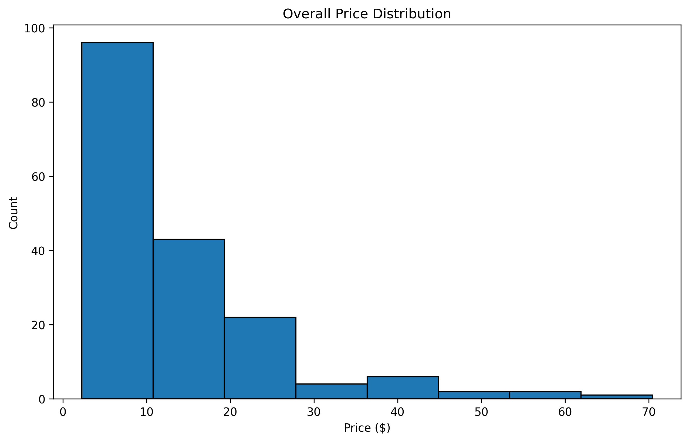

# 📊 Spice Market Analysis & Forecasting

## Overview
This project delivers **data-driven market insights** and **demand forecasting** for spice products using:
- **LSTM-based Time Series Forecasting**
- **NLP-based Competitor Analysis**
- **Customer Review Sentiment Clustering**

The workflow covers:
1. **Demand Forecasting** → Predict next 6 months of product demand using pricing & export index trends.
2. **Competitor Analysis** → Identify product categories, pricing gaps, and keyword opportunities.
3. **Review Sentiment & Clustering** → Group customer feedback into actionable sentiment-based clusters.

---

## 🔮 1. Time-Series Demand Forecasting

### **Approach**
- **Model:** LSTM (Long Short-Term Memory) neural network
- **Data:** 1,000+ months of synthetic demand, pricing, and export index data
- **Features:** 
  - Demand (target)
  - Price
  - Export Index
  - 12-month rolling lookback window
- **Performance:**
  - **MAE:** ~8.62
  - **RMSE:** ~10.54
  - **MAPE:** ~2.54%
- **Benefit:** Detects seasonal patterns & long-term growth trends.

### **Outputs**
| Metric | Value |
|--------|-------|
| MAE    | 8.62  |
| RMSE   | 10.54 |
| MAPE   | 2.54% |

#### **Training History**


#### **Forecast with 6-Month Projection**


#### **Demand Forecast (Test Set)**


---

## 🏷 2. Competitor Product & Price Analysis

### **Approach**
- **NLP Techniques:** Tokenization, Lemmatization, TF-IDF, LDA Topic Modeling
- **Data:** 100+ competitor spice product descriptions
- **Findings:**
  - **4** product categories identified (via LDA)
  - **15** high-impact keywords for SEO & marketing
  - **20%+** price gap opportunities in premium categories

### **Outputs**
#### **Word Cloud of Keywords**


#### **Top TF-IDF Terms**


#### **Price Histogram**


#### **Feature Correlations**


---

## 💬 3. Customer Review Sentiment & Clustering

### **Approach**
- **Sentiment Analysis:** VaderSentiment for polarity scoring
- **Text Embeddings:** Sentence-BERT (`all-MiniLM-L6-v2`)
- **Clustering:** KMeans + PCA for dimensionality reduction
- **Goal:** Identify common themes and sentiment in customer feedback

### **Cluster Labels (Example)**
| Cluster | Theme                          | Avg Sentiment |
|---------|--------------------------------|---------------|
| 0       | Positive Product Experience    | 0.82          |
| 1       | Negative or Critical Feedback  | -0.45         |

### **Cluster Visualization**


---

## 📂 Output Files

| File | Description |
|------|-------------|
| `reviews_sentiment_clustering.xlsx` | Multi-sheet report: cluster summary, top examples, full data |
| `reviews_scored_clustered.csv` | Reviews with sentiment & cluster assignments |
| `training_history_20250812_200137.png` | LSTM training loss curve |
| `history_plus_6mo_forecast_20250812_200137.png` | Predicted demand with future 6-month projection |
| `demand_forecast_test_20250812_200137.png` | Predicted vs actual demand (test set) |
| `wordcloud.png` | Competitor product keyword cloud |
| `tfidf_top_terms.png` | Top terms from TF-IDF analysis |
| `price_histogram.png` | Product price distribution |
| `feature_correlations_20250812_200137.png` | Correlation heatmap |
| `review_clusters.png` | Customer review clustering plot |

---

- data is generated synthetically, can be implemented on real dataset
  
## 🚀 How to Run

```bash
# Clone the repo
git clone https://github.com/your-username/your-repo.git
cd your-repo

# Install dependencies
pip install -r requirements.txt

# Run forecasting
python demand_forecasting.py

# Run competitor analysis
python competitor_analysis.py

# Run sentiment & clustering
python sentiment_and_clustering.py
